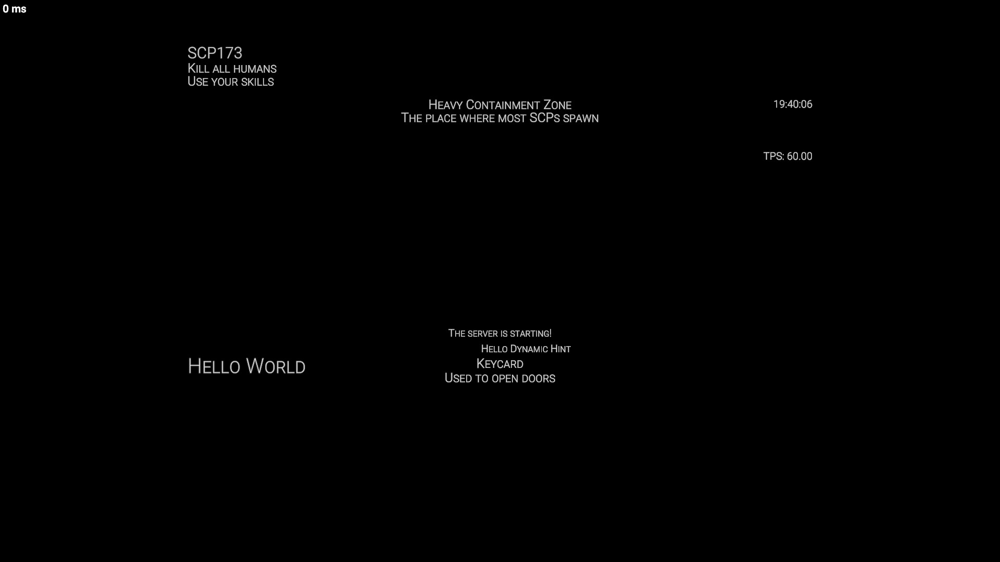

Нажмите [здесь](/Docs/Russian/README.md), чтобы вернуться к README

## Начало работы
### Настройка зависимостей
1. Создайте свой проект C#
2. Добавьте файл dll, скачанный из релиза, в зависимости вашего проекта
### Отображение первой подсказки
Следующие блоки кода показывают, как использовать часто используемые функции HSM.

---
Создание подсказки "Hello World" на экране игрока.
```CSharp
Player player = Player.Get(xxx);

// Hint — это простая подсказка, которую можно отображать на экране игрока.
Hint hint1 = new Hint
{
    Text = "Hello World" // Вы можете задавать свойства подсказки внутри пары фигурных скобок ({})
};

// Вы можете задать свойства подсказки следующим образом:
hint1.FontSize = 40;
hint1.YCoordinate = 700;
hint1.Alignment = HintAlignment.Left;
// После задания свойств не нужно вызывать никаких методов для запроса обновления. Все обновления будут выполняться автоматически через HSM (HintServiceMeow).

// Вы можете отобразить подсказку игроку, добавив её в PlayerDisplay игрока.
// Также её можно удалить, убрав из PlayerDisplay.
PlayerDisplay playerDisplay = PlayerDisplay.Get(player);
playerDisplay.AddHint(hint1);
// playerDisplay.RemoveHint(hint);

```
---
Используйте `AutoText` для создания подсказки, которая автоматически обновляет содержимое.

Используйте расширения для простого добавления или удаления подсказок.
```CSharp
Hint hint2 = new Hint
{
    AutoText = ev => DateTime.Now.ToString("HH:mm:ss"), // Вы также можете использовать функцию для задания текста подсказки, и подсказка будет обновляться автоматически.
    Alignment = HintAlignment.Right, // Вы можете задавать свойства подсказки в любом порядке и можете не задавать некоторые свойства, так как все они имеют значения по умолчанию.
    YCoordinate = 200
};

// Вы также можете использовать метод расширения для упрощения
player.AddHint(hint2); // Это эквивалентно playerDisplay.AddHint(hint);
// player.RemoveHint(hint); // Это эквивалентно playerDisplay.RemoveHint(hint);

```
---
Используйте `NextUpdateDelay` для настройки частоты обновления AutoText.

Используйте `PlayerDisplay::ShowHint(Hint, float)` для отображения подсказки на определённое время.
```CSharp
Hint hint3 = new Hint()
{
    YCoordinate = 300,
    Alignment = HintAlignment.Right,
    AutoText = ev =>
    {
        ev.NextUpdateDelay = TimeSpan.FromSeconds(2f); // Вы можете задать задержку следующего обновления в аргументе события, и подсказка обновится после задержки. Это полезно, когда нужно обновлять подсказку через определённые интервалы.

        return "TPS: " + Server.Tps.ToString("F2");
    },
};

// Если вы хотите отобразить подсказку временно, используйте ShowHint
playerDisplay.ShowHint(hint3, 12f); // Отображает подсказку 12 секунд, затем скрывает её.

```
---
Используйте DynamicHint для предотвращения конфликтов.
```CSharp
// DynamicHint — это подсказка, которая автоматически позиционирует себя, чтобы избежать перекрытия с другими подсказками.
DynamicHint dynamicHint = new DynamicHint
{
    Text = "Привет, динамическая подсказка",
    TargetX = 100f,
};

playerDisplay.AddHint(dynamicHint);

```
---
Используйте CommonHint для быстрой разработки пользовательского интерфейса.
```CSharp
// PlayerUI::CommonHint — это набор предустановленных подсказок, которые помогают легко отображать подсказки
PlayerUI ui = PlayerUI.Get(player);
ui.CommonHint.ShowRoleHint("SCP173", ["Убить всех людей", "Использовать навыки"]);
ui.CommonHint.ShowMapHint("Зона Тяжёлого Содержания", "Место, где появляется большинство SCP");
ui.CommonHint.ShowItemHint("Карта доступа", "Используется для открытия дверей");
ui.CommonHint.ShowOtherHint("Сервер запускается!");
```
---
Приведённые выше блоки кода создадут такой интерфейс:

С метками:


Прочитайте [Основные функции](CoreFeatures.md), чтобы узнать больше

Нажмите [здесь](/Docs/Russian/README.md), чтобы вернуться к README
