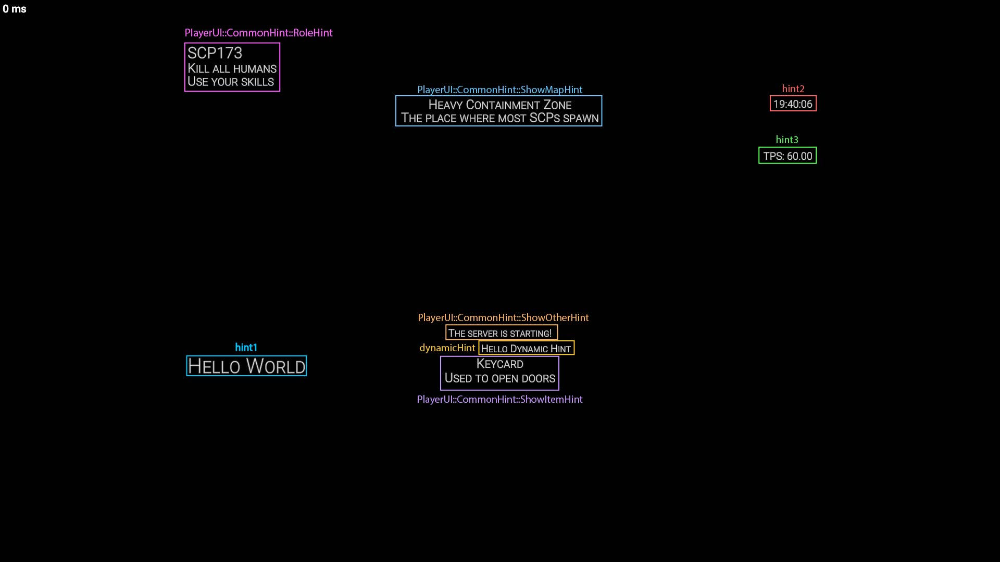

点击[此处](/Docs/SimplifiedChinese/README.md)返回 README

## 开始使用
### 设置依赖
1. 创建您的 C# 项目
2. 将从发行页面下载的 dll 文件添加到项目的依赖中
### 显示您的第一个 Hint
以下代码块展示了如何使用 HSM 的常用功能。

---
在玩家屏幕上创建一个 "Hello World" 提示。
```CSharp
Player player = Player.Get(xxx);

// Hint 是一个简单的提示，可以显示在玩家的屏幕上。
Hint hint1 = new Hint
{
    Text = "Hello World" // 您可以在一对大括号({})中设置提示的属性
};

// 您可以这样设置提示的属性：
hint1.FontSize = 40;
hint1.YCoordinate = 700;
hint1.Alignment = HintAlignment.Left;
// 设置属性后，您无需调用任何方法来请求更新。所有更新将由 HSM（HintServiceMeow）自动完成。

// 您可以通过将提示添加到玩家的 PlayerDisplay 来向玩家显示它。
// 也可以通过从 PlayerDisplay 中移除来删除它。
PlayerDisplay playerDisplay = PlayerDisplay.Get(player);
playerDisplay.AddHint(hint1);
// playerDisplay.RemoveHint(hint);

```
---
使用 `AutoText` 创建自动更新内容的提示。

使用扩展方法以更简便的方式添加或移除提示。
```CSharp
Hint hint2 = new Hint
{
    AutoText = ev => DateTime.Now.ToString("HH:mm:ss"), // 您也可以使用函数来设置提示的文字，提示将自动更新自身。
    Alignment = HintAlignment.Right, // 您可以按任意顺序设置提示的属性，也可以选择不设置某些属性，因为所有属性都有默认值。
    YCoordinate = 200
};

// 您也可以使用扩展方法使操作更简便
player.AddHint(hint2); // 这等同于 playerDisplay.AddHint(hint);
// player.RemoveHint(hint); // 这等同于 playerDisplay.RemoveHint(hint);

```
---
使用 `NextUpdateDelay` 设置 AutoText 的自定义更新频率。

使用 `PlayerDisplay::ShowHint(Hint, float)` 在特定时间内显示提示。
```CSharp
Hint hint3 = new Hint()
{
    YCoordinate = 300,
    Alignment = HintAlignment.Right,
    AutoText = ev =>
    {
        ev.NextUpdateDelay = TimeSpan.FromSeconds(2f); // 您可以在事件参数中设置下次更新延迟，提示将在延迟后自动更新。这在您希望按特定时间间隔更新提示时非常有用。

        return "TPS: " + Server.Tps.ToString("F2");
    },
};

// 如果您只想临时显示提示，可以使用 ShowHint
playerDisplay.ShowHint(hint3, 12f); // 显示提示 12 秒后隐藏它。

```
---
使用 DynamicHint 帮助避免冲突。
```CSharp
// DynamicHint 是一种可以自动定位以避免与其他提示重叠的提示。
DynamicHint dynamicHint = new DynamicHint
{
    Text = "Hello Dynamic Hint",
    TargetX = 100f,
};

playerDisplay.AddHint(dynamicHint);

```
---
使用 CommonHint 快速开发您的 UI。
```CSharp
// PlayerUI::CommonHint 是一组预设提示，帮助您轻松显示提示
PlayerUI ui = PlayerUI.Get(player);
ui.CommonHint.ShowRoleHint("SCP173", ["杀死所有人类", "使用你的技能"]);
ui.CommonHint.ShowMapHint("重型收容区", "大多数 SCP 生成的地方");
ui.CommonHint.ShowItemHint("钥匙卡", "用于开门");
ui.CommonHint.ShowOtherHint("服务器正在启动！");
```
---
上述代码块将创建如下所示的 UI：

标注版：


阅读[核心功能](CoreFeatures.md)了解更多

点击[此处](/Docs/SimplifiedChinese/README.md)返回 README
